# eitan-claude-skin

The **orca** skin for Claude Code, a [mod](https://code.claude.com/docs/en/plugins/mods/overview) that
redraws the transcript. Forked from [hellosverre/claude-skins](https://github.com/hellosverre/claude-skins)
(MIT) and cut down to one skin.

<picture>
  <source media="(prefers-color-scheme: light)" srcset="docs/previews/hero-light.svg">
  
</picture>

## Install

Needs Claude Code 2.1.287 or later, in a terminal or the desktop app's Code tab.

```
/plugin marketplace add eitan-ts/eitan-claude-skin
/plugin install eitan-skin@eitan-mods
```

## What it redraws

| Site | Desktop app | Terminal |
|---|---|---|
| Tool calls | A line icon per kind, lines changed and time taken | A node on the turn's rail with the same facts |
| Edits | A diff card | Claude Code's own diff |
| Shell commands | A terminal card with a Copy button | Claude Code's own output |
| Tables in replies | An animated card with zebra rows and Copy | A cell grid with a header band, zebra rows and Copy |
| Code blocks | A card with line numbers, highlighting and Copy | Claude Code's own markdown |
| Spinner | An animated icon per phase | The skin's word with a shimmer |
| Turn footer | (not raised on desktop) | Time, tool count and lines changed |
| The question dialog | A band naming its topics above the dialog | The same |

On a light Claude Code theme the palette switches to a derived light one.

## Settings

`/skin` opens the settings page. Quick switches: `/skin rail|tables|shimmer|clip on|off` and
`/skin icons unicode|ascii`. Choices are remembered across sessions.

## Develop

```bash
claude --plugin-dir .
claude plugin validate .
claude plugin test
npx -y tsx scripts/previews.ts   # redraws docs/previews
```

## License

MIT. Original work by hellosverre.
